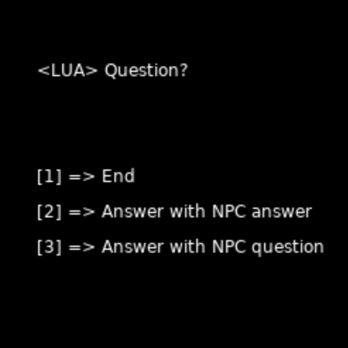

# LUA Dialogue System
A simple dialogue system I made. It's written in LUA using Love2D

To run it use ".\lovec.exe .\src" in terminal!



## Instructions

My dialogue system is managed by subtables.

Declare a new local variable that will contains our dialogues.

```
  local dialogue = {}
```
    
Next we will add our first dialogue line
```
  local dialogue = {
     {
        "First NPC line", {"First Answer"}
     }
  }
```

If we want to add another question after one specified answer we need to add a subtable to it
```
  local dialogue = {
     {
        "First NPC line", 
            {{"First Answer",
               {"Second NPC line",
                  {"Second Answer"}
               }
            }}
     }
  }
```